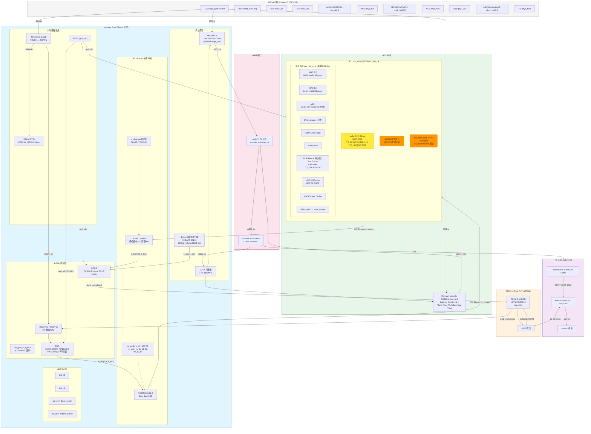

# ECO 板 FPGA 网络协议栈 — 拓扑结构



## 当前 buffer 布局

```
buffer[512] BRAM 布局:
  0                          255  320                    511
  ├────────────────────────────┤   ├──────────────────────┤
  │     RX 区域 (MAC RX 写)     │   │   TX 区域 (MAC TX 读) │
  │  IP头[0..4] TCP头[5..9]   │   │   TX_UDP_BASE=320    │
  │  载荷[10..143]             │   │   echo 帧写到这里     │
  │  最大 256 words = 1024B   │   │   192 words = 768B   │
  └────────────────────────────┘   └──────────────────────┘
                  256..319: TX_SCRATCH (ARP/ICMP)
```

## 数据流路径

```
RX: PC → PHY → RGMII → IDELAY → IDDR → RX_FIFO → AXI-Stream → IP1(MAC_RX→buffer)
TX: IP1(buffer→MAC_TX) → AXI-Stream → TX_FIFO → ODDR → RGMII → PHY → PC
UART: IP1(msg_stream) → IP2(uart_console) → TX_AND → CH340 → PC
Probe: NET_STATS ← RX/TX 计数 + 帧捕获 → TX_AND → CH340 → PC
```

## 已知问题

| 问题 | 状态 |
|------|------|
| buffer[39] byte 2 多段竞态 (offset 1726) | 🔧 4-FIFO 条件延迟缓解 (HLS调度依赖) |
| 4096B+ FIFO 容量不足 | 🔧 4条目限制, 需扩 FIFO + payload 保存 |
| msg_stream CDC FIFO 未做 | ⬜ UART ?stat 无输出 |
| ILA 探针插入 | ⬜ HLS 网表名不匹配, 需 Vivado GUI |